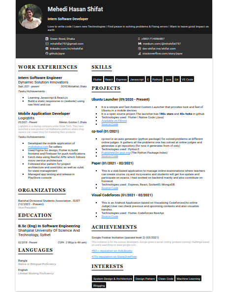

#cv

## Intro

**cv** is a static website that refers to the CV of [Mehedi Hasan Shifat](https://www.github.com/jspw) (me :D). It was my first task as an **Intern Software Engineer** in [Dynamic Solution Innovators](http://dsinnovators.com/) (one of the best software companies in Bangladesh) as its our training period.

<p align='center'>Hosted on <a href="https://jspw.github.io/cv/">jspw.github.com/jspw</a></p>

## About Task

The task was given  by our CTO [**Mojahedul Haque Abul Hasanat**](http://dsinnovators.com/masum.html).

### Detail

```
The "web" has taken the world by a storm. It started more than two decades ago. Most applications have a web based front-end.
HTML and CSS are the bread and butter of web applications.

Your first project is to write your CV in HTML. The CV has to have to following items:
    1.Your profile picture
    2.Your contact information
    3.A section with your academic history (school, college, university)
    4.A section list all the projects you have done. Each project should have a title and a description.

Make the CV look as polished as you can in the given timeframe. Use a global CSS file. Avoid inline styles as much as possible.

Do not use tables in the HTML.

```

## Technology used

- Raw html
- Raw css
- css-flexbox

## Feature

- Responsive

## Screenshot


